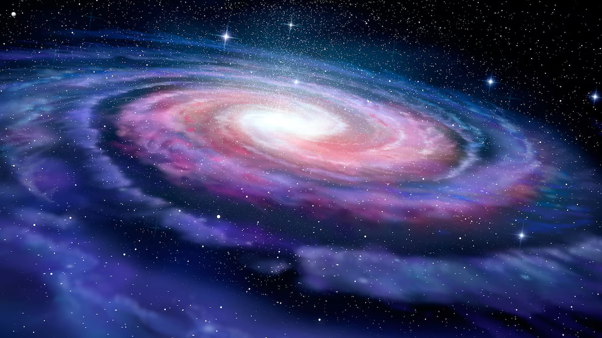
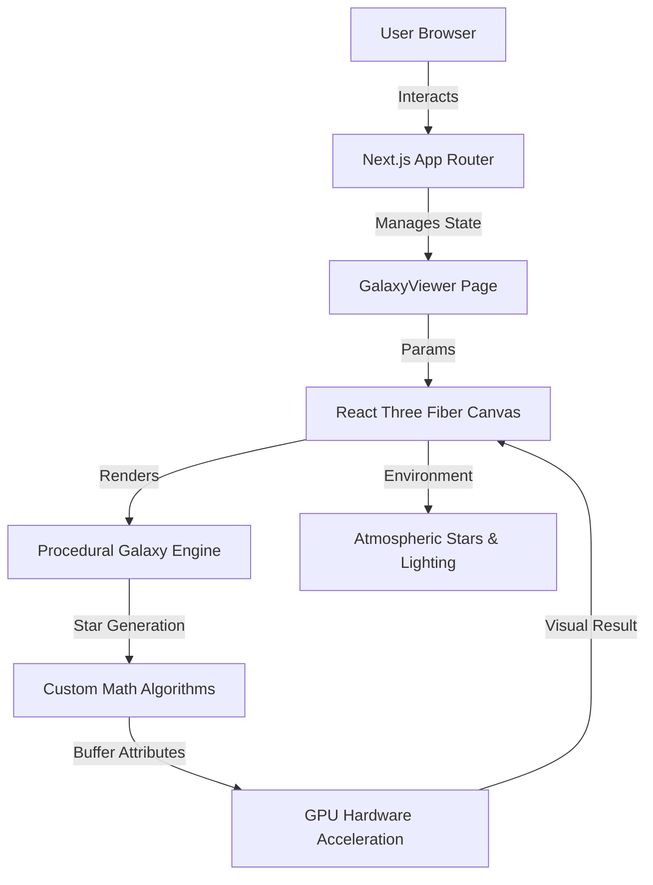

# 🌌 3D Galaxy Viewer — Procedural Cosmic Exploration

<div align="center">



### **Experience the Majesty of the Cosmos Everywhere**

[](https://nextjs.org/)
[](https://react.dev/)
[](https://docs.pmnd.rs/react-three-fiber)
[](https://tailwindcss.com/)
[](https://opensource.org/licenses/MIT)

</div>

---

## 🌟 Overview

Welcome to the **3D Galaxy Viewer**, a sophisticated, high-performance interactive simulation of architectural celestial bodies. Built using **Next.js 16**, **React 19**, and **Three.js**, this project leverages advanced procedural generation to render breath-taking spiral galaxies with dynamic star-dust, stellar clusters, and infinite cosmic permutations.

Control every detail of your own galactic creation—from the density of stardust to the mathematical spin of the spiral arms.

---

## 🏗️ System Architecture & Workflow

The architecture is designed for extreme performance and smooth real-time calculations directly in the browser's WebGL context.

### 🧩 High-Level Architecture



### ⚙️ The Workflow Loop

1.  **Initialization**: Upon mounting, the Next.js frontend initializes the **WebGL 2.0 context** via React Three Fiber.
2.  **Procedural Alchemy**: The `Galaxy` component calculates the position, color, and randomness of **100,000+ stars** using `useMemo`. This ensures heavy calculations only occur when the parameters genuinely change.
3.  **Real-Time Reconciliation**: As users tweak controls (via **Shadcn UI** toggles), React state updates globally. The engine instantly recalculates the galactic structure, updating the GPU buffer attributes without losing frame-rate.
4.  **Interactive Orbit**: **OrbitControls** allow a 6-DoF navigation through 3D space, while `useFrame` handles the constant smooth rotation of the galaxy.

---

## ✨ Premium Features

### 🔭 Deep-Space Interaction

- **6-DoF Navigation**: Seamlessly rotate, pan, and zoom through cosmic structures.
- **Atmospheric Effects**: Realistic lighting, star-field backgrounds, and night-themed environment presets.

### 🎨 Mathematical Beauty

- **Infinite Permutations**: Generates unique star clusters based on branches, spin, and radius.
- **GPU Optimization**: Renders massive amounts of geometry using **BufferGeometry** for maximum efficiency.

### 🎛️ Galactic Command Center

- **Stellar Population**: Scale from a primitive cluster to an overloaded dense core (up to 200k+ stars).
- **Geometric Sculpting**: Define the radius, spiral arms, and spin velocity with precision.
- **Chromatic Control**: Deep-core and outer-edge color customization for alien galaxy creation.
- **Entropy Tuning**: Adjust randomness and entropy power to create chaotic or perfect spirals.

### 📱 Responsive PWA Mastery

- **Device Intelligent**: Automatically scales performance metrics based on device type (Mobile vs Desktop).
- **Home Screen Enabled**: Fully functional **Web App Manifest (PWA)** for an app-like experience on iOS and Android.
- **Smooth Cursor**: Custom-built interactive cursor that reacts to your movement (Disabled on touch devices for accuracy).

---

## 🛠️ Technology Stack

| Technology            | Purpose                                                    |
| :-------------------- | :--------------------------------------------------------- |
| **Next.js 16**        | Modern App Router architecture & Server-side optimization. |
| **React 19**          | Concurrent rendering and advanced state management.        |
| **React Three Fiber** | Declarative Three.js integration for the React ecosystem.  |
| **Three.js (R3F)**    | The heavy-lifting WebGL engine for 3D graphics.            |
| **Framer Motion**     | Slick UI animations and custom cursor fluidity.            |
| **Tailwind CSS**      | Glassmorphic design system and high-speed styling.         |
| **Lucide React**      | Modern, accessible iconography.                            |

---

## 🚀 Getting Started

Follow these steps to establish your own local mission control:

### 👣 1. Clone & Navigate

```bash
git clone https://github.com/CodeWithBasu/3D-Galaxy.git
cd 3d-galaxy
```

### 📦 2. Install Payload

```bash
npm install
```

### 🛰️ 3. Deploy Local Satellite

```bash
npm run dev
```

### 🌌 4. Access the Void

Open `http://localhost:3000` to start your journey.

---

## 🎮 Navigation Controls

| Input Device    | Action     | Description                                   |
| :-------------- | :--------- | :-------------------------------------------- |
| **Mouse Left**  | Rotate     | Manipulate the perspective around the center. |
| **Mouse Right** | Pan        | Shift the view vertically or horizontally.    |
| **Scroll**      | Zoom       | Move deep into the core or far into the void. |
| **Touch (1)**   | Rotate     | Drag with one finger to rotate the universe.  |
| **Touch (2)**   | Pan / Zoom | Pinch to zoom; drag with two fingers to pan.  |

---

## 👨‍💻 Visionary Behind the Project

**BASUDEV** — _Creative Developer & Cosmic Architect_

<div>
  <a href="https://github.com/CodeWithBasu">
    
  </a>
</div>

---

<div align="center">
  <i>"Somewhere, something incredible is waiting to be known." — Carl Sagan</i>
  <br/>
  <b>Crafted with ❤️ by CodeWithBasu</b>
</div>
